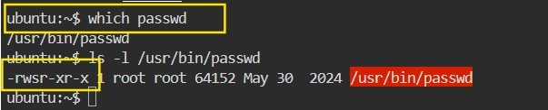
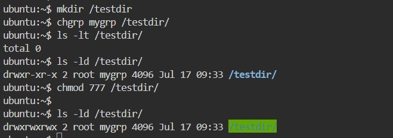
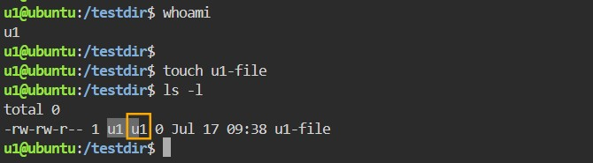
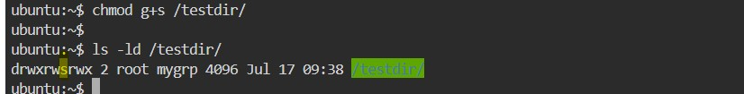
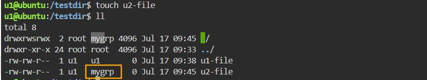
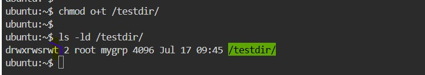
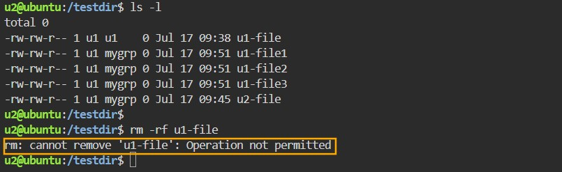

## CONTROLLING ACCESS TO FILES

1. Special Permissions or Advanced Permission
2. Access Control List (ACL)

| Permission              | Symbolic Form | Numeric Form | Syntax |
| :---------------- | :------: | ----: | -----:|
| SETUID        |   s or S   | 4  | chmod u+s or chmod 4766 |
| SETGID        |   s or S   | 2  | chmod g+s or chmod 2766
| STICKY BIT |  t or t | 1 |chmod o+t or chmod 1766 |

**Note:** Note: Where s= setuid + execute permission and S= setuid only. Same is for SGID and also for sticky bit.

### SUID – SET USER ID
Change user ID on execution. If SETUID bit is set, when the file will be executed by a user, the process will have the same rights as the owner of the file being executed. Many of the system commands are the best example for SUID, basically the owner of the commands will be root, but still a normal user can execute it.

e.g. By default **passwd** command is having suid,  so all users can run that command but if suid is removed and a normal user wants to user execute it, then they would not be able to use it to update */etc/shadow* with new passwd.

**Note: observe that in the permissions “–rwsr-xr-x” it contains an “s”, which means SUID is placed. Let’s try to remove suid on passwd command and logged in as normal user and check the results.

### SGID – SET GROUP ID
When a directory is created and its group is set to some group. Now if SGID is applied to it, and the group member creates files and directory inside it, then it will get the same group rather than getting user’s primary group 

e.g. let's see it practically.

Login as other user, access the directory, create some files and check the group it is getting. ( It will be getting the logged in user’s group)

Now, as a root, assign SGID on the directory

**Syntax:** chmod g+s /mydir

Try creating other files with other user(s) in the same directory, instead of getting it’s own group it would now be inheriting directory’s group.

## STICKY BIT
If sticky bit is applied on a file or directory, then only root and owner of that file or directory can delete it. Even if others are having full permissions they cannot delete or edit the contents of the directory.

Apply sticky bit to the directory

Access the directory with other user and try deleting the files

