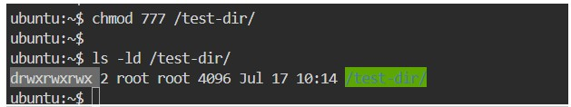
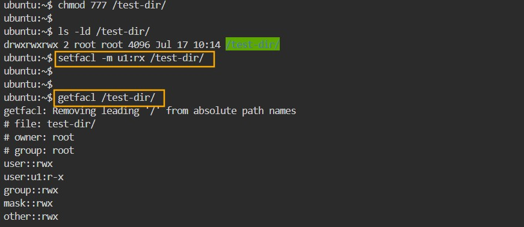
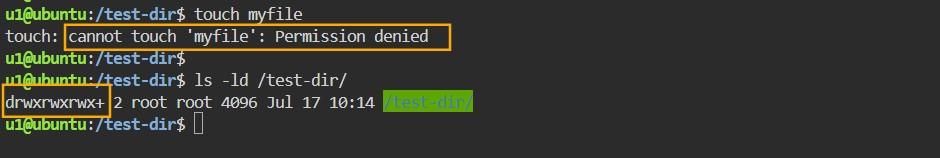

## Access Control List (ACL)

getfacl /test-dir

**Example:** Now let’s assign full permission to the directory and then apply acl on it, so that we can analyze how acl will work.

The syntax to apply acl is
- setfacl [option] [argument] [file or directory name]
- The options are,
  - -m Modifies an ACL
  - -x Removes an user/group from ACL
  - -R Recurses into subdirectories
  - -b completely banishing/removing the ACL from a file/directory

The possible arguments are
  - u: user
  - g: group

To assign read and execute permission to a u1 user
**Syntax:** 
- setfacl –m u: [username]: [permissions] [file or dir name]
- **Example:** setfacl -m -u:rx /test-dir
- verify by using getfacl

Now login as u1 user and try to create a file inside /test-dir, as we have not assigned write permission to u1 user, though it is having full permissions, still it will not allow u1 user to create a file inside it.

Observe that when you check for the permissions it is showing a + sign after normal
permission, that indicate that ACL is applied on this directory.

**Assigning read and execute permission for a user and a group at same time.**

- setfacl –m u:u1:rx,g:g1:rx /test-dir

**Removing acl for a particular user** 

- *Syntax:* setfacl –x u:[username] [DirName]
- setfacl –x u1 /test-dir; #setfacl –x u:u1 /

**Removing acl for a particular group**
- *Syntax:* setfacl –x g:[groupName] [directoryName]
- setfacl –x g: g1 /test-dir

**Removing all ACL permissions from a file or directory**

- *Syntax:* setfacl –b [DirectoryName]
- setfacl –b /test-dir

**To Apply /Remove ACL recursively on a directory and its contents**
