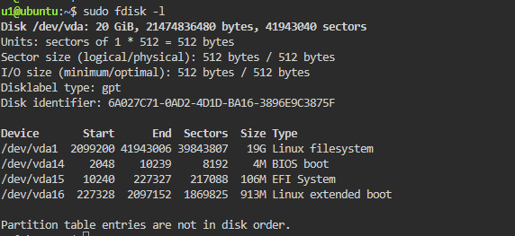
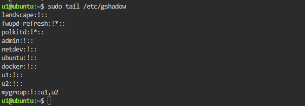

### ENHANCE USER SECURITY WITH SUDO

- Restricts access to sensitive commands.
- Logs all sudo commands (accountability).
- Can grant specific permissions to specific users.
- Avoids full root login—safer and more controlled.

e.g. sudo apt update, sudo rpm -Uuvh *.rpm, sudo systemctl restart nginx, etc.

- The file **/etc/sudoers** file has the rules that users have to follow when using sudo command. That means that whatever commands access is provided to any user in
**/etc/sudoers** file, that user can only run those commands.
- Always use **visudo** to edit sudo configuration files.
- Set default editor: vim ~/.bashrc, add this **export EDITOR=vi** bottom at the bottom and reload profile using **source ~/.bashrc**

what is **root ALL=(ALL) ALL**

This lines means that the user root can execute from ALL terminals, acting as ALL (any) users, and run ALL (any) command.

So the first part is the user, the second is the terminal from where the user can use
sudo, the third is as which user he may act, and the last one, is which commands he
may run.

        ALL  ALL=(ALL:ALL) ALL 

        General Syntax:
        <user or group> <host> = (<runas_user>:<runas_group>) <command>

| Part         | Meaning                                                                                                                                          |
| ------------ | ------------------------------------------------------------------------------------------------------------------------------------------------ |
| `ALL` (1st)  | **Which users this rule applies to**. If it's in a group section, it's the group of users.                                                       |
| `ALL` (2nd)  | **Which host(s)** the rule applies to. Usually `ALL`, since most systems aren't clustered.                                                       |
| `(ALL:ALL)`  | **Runas Specification**: `(user:group)`  - First `ALL`: allowed to run as **any user**  - Second `ALL`: allowed to run as **any group** |
| `ALL` (last) | **Which command(s)** can be run – in this case, **any command**                                                                                  |
### View SUDO History

        sudo cat /var/log/auth.log | grep sudo (ubuntu)
        sudo cat /var/log/secure (RedHat, CentOS)

### Add a user to sudo group

        sudo usermod -aG sudo u1

### Let's give users sudo access to only specific command.

Allow user to restart nginx with sudo only.

open sudo configuration file with visudo command and add below command to bottom of the file.

        userName ALL=(ALL:ALL) NOPASSWD:/usr/bin/systemctl restart  nginx

userName - The User \
ALL - From any Host \
ALL - can run as any user or group \
NOPASSWD - Don't prompt for password \
/usr/bin/systemctl restart nginx - only command user can run 

### Allow a user root privileges like root

- To assign root privileges to user add a lineby using sudoers file as shown below.
**visudo** (save the sudoers file as we save vim file using **wq!**)

- Now loged in as u1 user and run admin command like **fdisk -l**
- First try to run fdisk command normally and see what happens.

- It will not allow a normal user to run privileged user's command.
- Now run the same command using sudo before command.

### Allow a group called mygroup, all root privileges.

- let's first check the members of mygroup and then apply root privilege.
**(tail /etc/gshadow)**

- How to add users in mygroup

        sudo usermod -aG mygroup u2
        tail /etc/gshadow

- As we know the users in mygroup, let's assign it root privileges.

- Now log in as one of the user of mygroup try root command.

### Allow a user **u2** to run all commands without prompting for his password anytime.
To allow run all command, The syntax we have already seen, but allow him run command's without prompting passwd a small change is to be made.

### Restrict user **u1** to run only two root commands.

- let's give **u1** user to run only **fdisk** and **parted** command access. \
- First check the complete path of those command by using **which fdisk** and **which parted**
- let's assign both above paths in sudoers file.
- visudo

Add to bottom of the file.

                u1    ALL=(ALL) /sbin/fdisk, /sbin/parted

### Allow a group **mygroup** to run network related commands as sudo user.

- To allow a group run only network commands, 

### Allowing user all commands except few commands

- Most of the time it might be require to block few commands from users, even though all commands have been granted. It is an important aspect as per security view.
- Let's assume we want to block **visudo** and **su** commands.
- Find out the path of those two command needs the be block. (which visudo and which su)

- Now, allow all the commands to user2 and block the above two by using an **! Exclaimation mark**.

# Networking
Study about - IP, Route, route table, subnet, CIDR, gateway

https://study-ccna.com/
