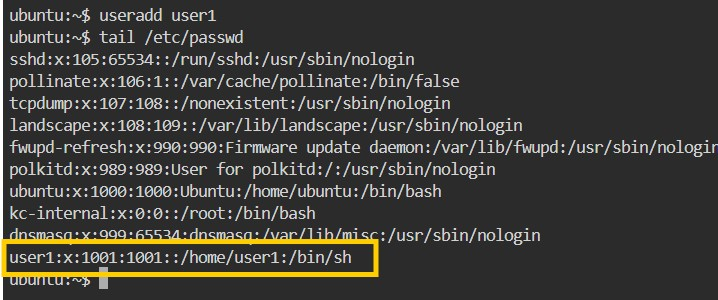
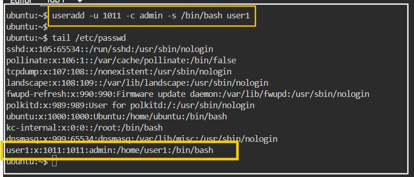
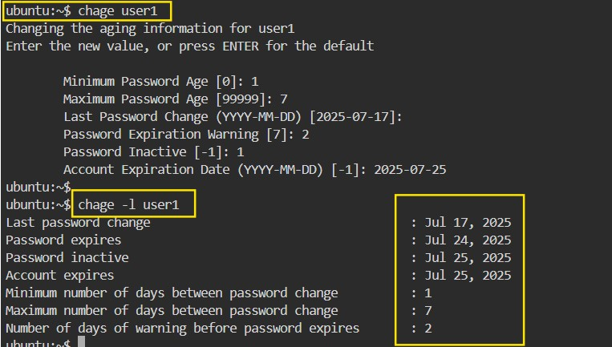

## PART-I - USER AND GROUP ADMINISTRATION 

In linux user is one who use the system, ther can be at least one or more than one user in linux at a time. Users on a system are identified by username and userId.
- Every user is assigned a unique User ID number (UID); UID 0 identifies root
- Users are assigned to groups Each group is assigned a unique Group ID number 
(gid)
- Users cannot read, write or execute each others' files without permission
- All users in a group can share files that belong to the group
- Every file is owned by a UID and a GID
- Every process runs as a UID and one or more GIDs ; Usually determined by who 
runs the process

#### Some important Points related to users:

| Type       | Example | User ID (UID)       | Group ID (GUID) | Home Directory | SHELL |
|:-----------|:---:|-----------:| :-----------:  | :-----------:  | :-----------:  |
| Super User |  root | 0   | 0  | /root  | /bin/bash  |
| System User|  ftp, ssh  | 1 to 999 | 1 to 999  | /var/ftp  | /sbin/nologin  |
| Normal user  | user | 1000 to 60000    | 1000 to 60000  | /home/user-name  | /bin/bash  |

**Super User (root):** He is administrator user.

**System User:** System user are the users created by softwares or applications. for example if you install apache it will create a user called apache. these kind of user called as system users.

**Normal User:** Normal user are the users created by root user. They are normal user like Pravin, trupti, pratulsh etc.

### Whenever a user is created in Linux things are created by default:
1. A home directory (/home/username)
2. A mail box is created (/var/spool/mail/username)
3. unique UID and GID are given to user

### Linux uses UPG (User Private Group) scheme
1. It means that whenever a user created is has it's own private group
2. For example, if user is created with the name **pravin**, then the primary group for that user will be **pravin** only

### There are two important files a user administartor shoul be aware of
1. /etc/passwd
2. /etc/shadow

### Create a user

A syntax for creating a user in linux is

useradd `options` user-name and adduser `option` user-name

options are:
- -u user id
- -G Secondary group id
- -g primary group id
- -d home directory
- -c commit
- -s shell

### Lets create a user with default attribute

- When no option is used with useradd command the options like uid, gid, home dir and shell will be assigned default.
- **useradd username**
- **useradd user1**
- check user details: cat /etc/passwd, id username

### Let's create a user with customized attribute

- create user with following attribute
-  Name = user1
-  uid = 1001
-  comment = admin
-  shell = /bin/sh
-  command: useradd -u 1011 -c admin -s /bin/sh user1

### Assigning password to the user
- as root user we can assign any password to any user
- syntax: **passwd username**

### Modifying the user's attribute
- After creating a user if we need to modify the attribute of user like changing uid, changing secondary group id, or adding a comment, locking or unlocking the user account, can be dine by using usermod command.
- **syntax:** usermod option username, get option use usermod --help or usermod -h
- **example:** usermod -l newName Oldname - (Changing the name of the user)
- **usermod -L username**  to lock the user account; **passwd -l username**

### Locking and unlocking a user account
- usermod -L userName; passwd -l userName
- e.g. usermod -L myuser; passwd -l myuser
- verify it in /etc/shadow file, it shows exclaimation mark before user account or try using **passwd -S userName**

### Unlocking a user account
- Unlock the above account
- usermod -U myuser; passwd -u myuser
- e.g. usermod -U myuser; passwd -u myuser
- verify it in /etc/shadow file, it shows exclaimationmark before user account is gone.

### The password parameter
- For any user we can set the parameter for the password, like **min** and **max passwoed age**, **password expiration warnings** and **account expiration date** etc.
- To view the advance parameter of the user, use
- **chage -h** for help
- e.g. **chage -l user1**

### Changing the password parameters:
- Changing of the password parameter can be done by two ways.
  1. chage userName
  2. chage option value username
- **Method one:** let's set the passwoed parameterof a user user1 to
  - Min password age: 1 day
  - Max password age: 7 days
  - Passwoed expiration warnings: 2 days before password expires
  - Password inactive [-1] 1 one day later the account will be locked, after password expiry.
  - Account expiration date: 2025-07-25 (July 25th 2025)

  
 

The second method is for, if you want to change a particular field of password aging policy

- **chage option value username**
  - The options which can be used are as follows
  - -m for Min password age
  - -M for Max password age
  - -d for last time the password is changed. ( Note: if given d 0, it will force the user to change password at next login) \
  - -W Password expiration warnings
  - -I Password inactive [-1 means inactive].
  - -E A/C expiration date

Let’s see how to change only the account expiration date

**command**: chage -E 2025-07-25 user1

### Forcing a user to change the password at next login

Sometimes it is required to force the users to change their password at next login. This can \
be done using following syntax
- chage –d 0 username, (where 0 = zero days since last password change)
- chage –d 0 myuser

## PART-II GROUP ADMINISTRATION

### groups
- Users are assigned to groups with unique group ID numbers (the GID)
- The group name and GID are stored in **/etc/group**
- Each user is given their own private group
- They can also be added to their groups to gain additional access
- All users in a group can share files that belong to the group

Each user is a member of at least one group, called a primary group. In addition, a user can be a member of an unlimited number of secondary groups.

A user’s primary group is defined in the **/etc/passwd** file and Secondary groups are
defined in the **/etc/group** file.

### Creating a Group with default options:

**Syntax:** groupadd [GroupName]

### Creating a group with user specified group id (GID)
**Syntax:** groupadd [option] [GroupName]

groupadd -g 1050 mygrp2\
Verify it in **/etc/group**

### Modifying the properties of the group
**Syntax:** groupmod [option] [arguments] [GroupName]

The options are:
- *-g* - to change the group id
- *-o* - to override the previous assigned id, if it matches with the new one.
- *-n* - to change the group name

### Changing the GID of the group
groupmod –g 1100 mygrp

### Changing the name of the group
**Syntax:** groupmod –n [NewGroupName] [existingGroupName]

### Adding and Removing Members to a Group
- Adding single or multiple users to the group with various attributes
- gpasswd [option] [arguments] [GroupName]

Options:
- -M For Adding Multiple users to a group
- -a for Adding a single user to a group
- -A for Adding a group Administrator
- -d removing a user from a group

**Syntax:** gpasswd –M [user],[user],[user] [group] \
gpasswd –M u1,u2,u3 mygroup

Adding single user to the group\
**Syntax:** gpasswd –a u4 mygroup

### Making a user as an administrator of the group
gpasswd –A u1 mygroup (verify it in /etc/gshadow)

### Removing a user from the group
**Syntax:** gpasswd –d u2 mygroup

### Removing a group
groupdel [groupName]

