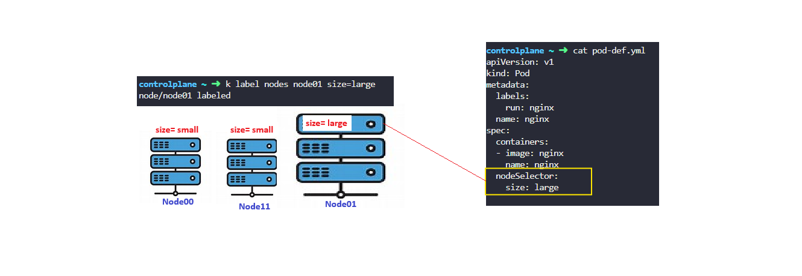
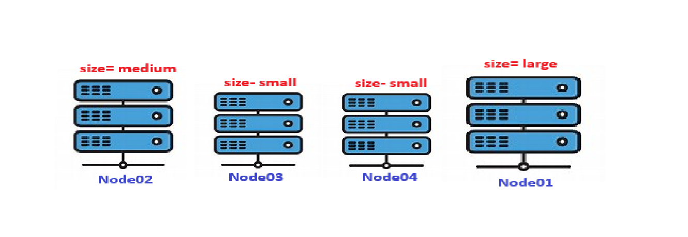

# Node Selector (nodeSelector)

NodeSelector can not provide advance expressions.

**Example:** You have a three node cluster of which two are smaller nodes with lower hardware resources, and one of them is a larger node configured with higher resources.

In my Kubernetes cluster, I have three nodes—two labeled as small and one labeled as large. I wanted to ensure that certain workloads run only on the large node due to their higher resource requirements.

To achieve this, I used the nodeSelector field in the pod specification. This allows me to schedule pods on nodes that match specific labels. By setting nodeSelector: size=large, I ensure that the pod is scheduled only on the node labeled size=large.

look at the pod definition file above. This file has a simple definition to create a pod with nodeSelector property to spec section and specifies szie as large.

but, **where did the size large come from and how does k8s knows which is the large node and which is the small node?**

it is come from labels, The key value pair of size and large in fact labels assigned to the nodes. The scheduler uses these labels to match and identify the right node to place the pods on.

nodeSelector served our purpose but it has limitations. we used a single labels and selector to achieve our goal here.

But **what our goal is/requirement is much more complex?**

something like place the pods on a large and medium node or somthing like place a the pod on any node that are not small.

we can not achieve thi using nodeSelectors for this, node affinity and anti-affinity features come in picture.

