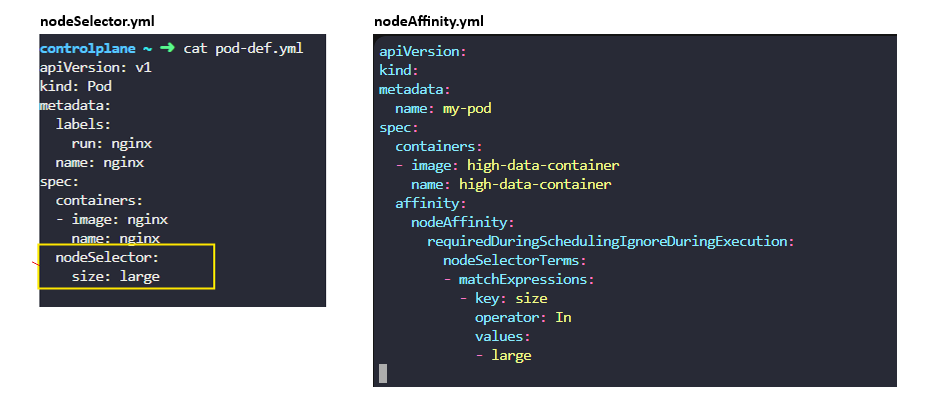

# Node Affinity

The primary purpose of node affinity feature is to ensure that pods are hosted on particular nodes.

When the pods are created, these rules considered and pods are placed onto thr right nodes.

We can not privide advanced expressions like or / not with node selector. The node affinity features provide advance capabilities to limit pod placement on specific noded.

With great power comes great complexity,

refer here

nodeSelector and Node Affinity, although both does exactly the same thing.

Place the pod on the large node. Under spec you have affinity and then node affinity under that. And then you have a property that looks like a sentence called,

*required during scheduling, ignored during execution.*

You have the node selector terms, that is an array and that is where you will specify the key and value pairs. The key value pairs are in the form

*key, operator and value,*

where the operator is in. The in operator ensures that the pod will be placed on a node whose label size has any value in the list of values specified here? In this case, it is just one called large.

If you think your pod could be placed on a large or a medium node, you could simply add the value to the list of values like this.

You could use the node in operator to say something like, size not in small,

where node affinity will match the nodes with a size not set to small. We know that we have only set the label size to large and medium nodes. The smaller nodes don't even have the label set so we don't really have to even check the value of the label. As long as we are sure we don't set a label size to the smaller node,

using the exist operator will give us the same result.

**Q. Create a new deployment named blue with the nginx image and 4 replicas, and ensure it gets placed on the node01 node only.Use the label key color and value blue**

        apiVersion: apps/v1
        kind: Deployment
        metadata:
        labels:
            app: blue
        name: blue
        spec:
        replicas: 1
        selector:
            matchLabels:
            app: blue
        template:
            metadata:
            labels:
                app: blue
            spec:
            containers:
            - image: nginx
                name: nginx
            affinity :
                nodeAffinity:
                requiredDuringSchedulingIgnoredDuringExecution:
                    nodeSelectorTerms:
                    - matchExpressions:
                    - key: color
                        operator: In
                        values:
                        - blue
 
Q. Create a new deployment named red with the nginx image and 2 replicas, and ensure it gets placed on the controlplane node only.

Use the label key - node-role.kubernetes.io/control-plane - which is already set on the controlplane node.

        apiVersion: apps/v1
        kind: Deployment
        metadata:
        name: red
        spec:
        replicas: 2
        selector:
            matchLabels:
            app: red
        template:
            metadata:
            labels:
                app: red
            spec:
            containers:
            - name: nginx
                image: nginx
            affinity:
                nodeAffinity:
                requiredDuringSchedulingIgnoredDuringExecution:
                    nodeSelectorTerms:
                    - matchExpressions:
                    - key: node-role.kubernetes.io/control-plane
                        operator: Exists