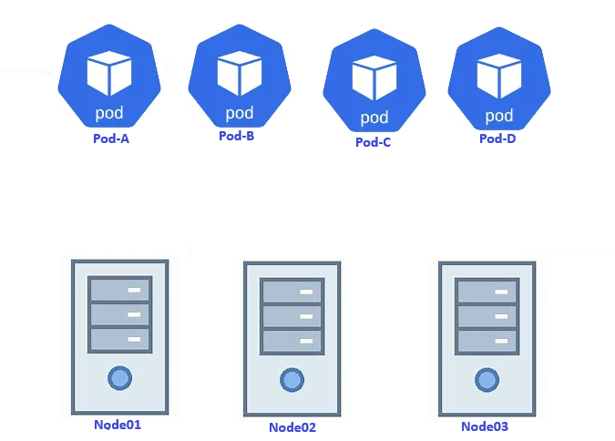
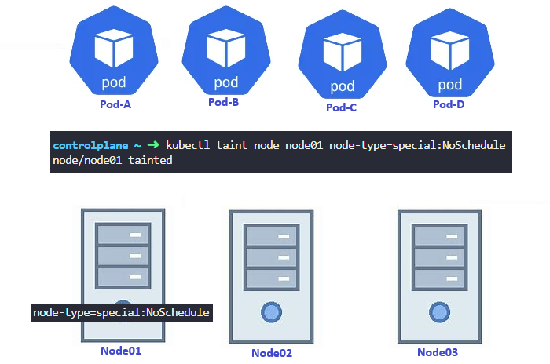
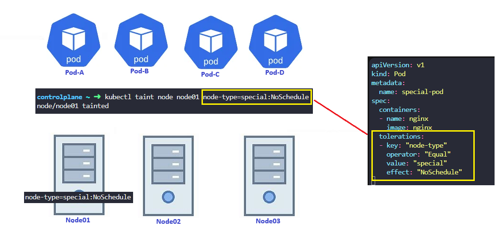

# Kubernetes Taints and Tolerations:

In **Kubernetes**, taints and tolerations are powerful tools that control which pods can be scheduled on which nodes. They’re essential for managing workloads in production environments, especially when dealing with dedicated nodes, special hardware, or resource isolation. Taint and Toleration is nothing but a relation between node and pods.
and how you can restrict what pods are placed on what nodes.

### What Are Taints and Tolerations?
**Taints:** Taint is kind of labeling that are applied to nodes and allow a node to repel a set of pods.

**Tolerations:** are applied to pods and allow (but do not require) the pods to be scheduled on nodes with matching taints. ou apply taints to a node through the node specification (NodeSpec).

### Example-01:

Let us start with a simple cluster with three worker nodes. The nodes are Node01, Node02 and Node03.

We also have a set of pods that are to be deployed on these nodes.

**Example-02:**

Let's call them Pod-A, Pod-B, Pod-C, and Pod-D. When the pods are created, Kubernetes scheduler tries to place these pods on the available worker nodes. If you not assign toleration to pods and taint to the nodes so, there is no restrictions or limitations. The scheduler places the pods across all of the nodes to balance them out equally.

Now, let us assume that we have dedicated resources on Node01 for a particular use case or application. So we would like only those pods that belong to this application to be placed on Node01. First, we prevent all pods from being placed on the node by placing a taint on the node. Let's call it node-type=special . By default, pods have no tolerations, which means unless specified otherwise, none of the pods can tolerate any taint. So in this case, none of the pods can be placed on node one, as none of them can tolerate the taint node-type=special. This solves half of our requirement. No unwanted pods are going to be placed on this node.

**Example-03:**

To enable certain pods to be placed on this node01. For this we must specify which pods are tolerant to this particular taint. In our case, we would like to allow only Pod-D to be placed on this Node01.So we add a toleration to Pod-D. Pod-D is now tolerant to node-type=special.

So when the scheduler tries to place this pod on Node01, it goes through. Node-01 can now only accept pods that can tolerate the taint node-type=special.

So with all the taints and tolerations in place, this is how the pods would be scheduled.

The scheduler tries to place Pod-A on Node01, but due to the taint it is thrown off and it goes to Node02. The scheduler then tries to place Pod-B on Node01, but again, due to the taint, it is thrown off and is placed on Node03, which happens to be the next free node. The scheduler then tries to place Pod-C to the Node01. It is thrown off again and ends up on Node02.

And finally the scheduler tries to place Pod-D on Node01.

**Note:** *Remember, taints are set on nodes and tolerations are set on pods.*

Remember taints and tolerations are only meant to restrict nodes from accepting certain pods. In this case, node one can only accept Pod-D, but it does not guarantee that Pod-D will always be placed on node one. Since there are no taints or restrictions applied on the other two nodes, Pod-D may very well be placed on any of the other two nodes.
So remember, taints and tolerations does not tell the pod to go to a particular node. Instead, it tells the node to only accept pods with certain tolerations. If your requirement is to restrict a pod to certain nodes, it is achieved through another concept called as **node affinity**

## Taint a Node

Taint a node is similar to labeling a node

        kubectl taint node node01 node-type=special:NoSchedule

| Effect    | Description |
| -------- | ------- |
| NoSchedule | New pods that do not match the taint are not scheduled onto that node. Existing pods on the node remain.  |
| PreferNoSchedule | New pods that do not match the taint might be scheduled onto that node, but the scheduler tries not to.  Existing pods on the node remain  |
| NoExecute   | New pods that do not match the taint cannot be scheduled on that node. Existing pods on the node that do not have a matching toleration are removed.   |

## Tolerate a Pod

As Tolerations are set at pod level, it will also work with any higher level objects like deployments or even projects.

**Example:**

        apiVersion: apps/v1
        kind: Deployment
        metadata:
        name: nginx-deployment
        spec:
        selector:
            matchLabels:
            app: nginx
        replicas: 10
        template:
            metadata:
            labels:
                app: nginx
            spec:
            containers:
            - name: nginx
                image: nginx:1.7.9
                ports:
                - containerPort: 80
            tolerations:
            - effect: NoSchedule
                operator: Exists 

